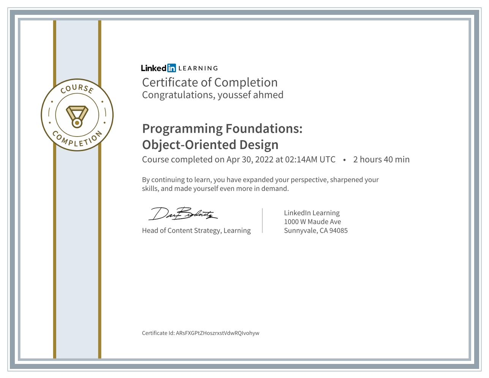

# Programming Foundations: Object-Oriented Design

### Course details

- All good software starts with a great design. Object-oriented design helps developers plan applications before they write a single line of code, and break down ideas into reusable and maintainable components. This course focuses on the foundational concepts, teaching them in a fun, interactive way to help you quickly develop your skills. Tag team Olivia and Barron Stone introduce you to the concepts and terms—objects, classes, abstraction, inheritance, and more—that you need to get started. They then show how to take the requirements for an app, identify use cases, and map out classes using Universal Modeling Language (UML). The final design can then be translated into code using one of the many popular object-oriented programming languages, such as Java, C#, Ruby, or Python.

### Learning objectives

- Object-oriented basics: objects, classes, and more
- Encapsulation
- Inheritance
- Defining requirements
- Identifying use cases, actors, and scenarios
- Domain modeling
- Identifying class responsibilities and relationships
- Creating class diagrams
- Using abstract classes
- Working with inheritance
- Developing software with object-oriented design principles

---

[Course Link](https://www.linkedin.com/learning/programming-foundations-object-oriented-design-3/)
 [Preview Certificate](https://www.linkedin.com/learning/certificates/69f88353a6bf13280f50ef85e651df8e020475299066c1131477dcbb4fef8410?trk=share_certificate&lipi=urn%3Ali%3Apage%3Ad_flagship3_profile_view_base_certifications_details%3B4H1xp3l%2FSr2fyyy2SWoa9w%3D%3D)

