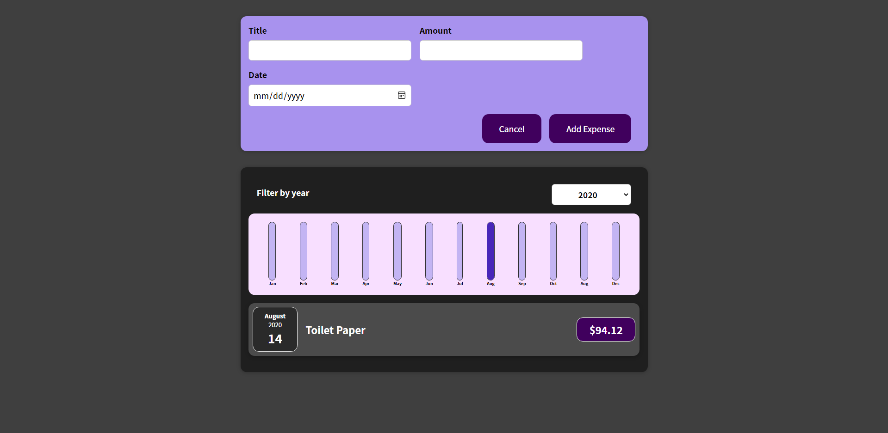

# React - The Complete Guide (incl Hooks, React Router, Redux)

## Projects

### expenses-app (S3-S5)

- [Section 3 Code](./Projects/Expenses-app/S03-project)
- [Section 4 Code](./Projects/Expenses-app/S04-project/)
- [Section 5 Code](./Projects/Expenses-app/S05-project/)

   

- [Section 3 Project Live Demo](https://expenses-app-v1.netlify.app/)
- [Section 4 Project Live Demo](https://expenses-app-v2.netlify.app/)
- [Section 5 Project Live Demo](https://expenses-app-v3.netlify.app/)

   

  

### goals app (S6-S7)

- [Section 6 Code](./Projects/goals-app/S06-project/)
- [Section 7 Code](./Projects/goals-app/S07-project/)

 

- [Section 6 Project Live Demo](https://goals-app-v1.netlify.app)
- [Section 7 Project Live Demo](https://goals-app-v2.netlify.app)
- 

### Users app Project (S8 - S9)

- [Project-code](./Projects/section-8-9-project)
- [Live Demo](https://users-app5.netlify.app/)
  (./app-screen/users-app.png)

### Login-app (S10)

- [Project-code](./Projects/Login-app-s10/)
- [Live Demo](https://login-app-5.netlify.app/)
  (./app-screen/login-app.png)

### Order-food App (S11)

- [Project-code](./Projects/order-food-app/S11-project/)
- [Live Demo](https://order-app-v1.netlify.app/)
  (./app-screen/order-food-v1.png)

### Behind the scenes project (S12)

- [Project-code](./Projects/S12-project)
- [Live Demo](https://behind-the-scenes.netlify.app/)
  (./app-screen/behind-scenes.png)

### Class based components Project (S13)

- [Project-code](./Projects/S13-project)
- [Live Demo](https://class-component.netlify.app/)
  (./app-screen/calss-cmp.png)

### movies app (S14)

- [Project-code](./Projects/movies-app)
- [Live Demo](https://movies-app-5.netlify.app/)
  (./app-screen/movies-app.png)

### Tasks app with firebase(S15)

- [Project-code](./Projects/task-app-firbase/)
- [Live Demo](https://task-app-5.netlify.app/)
  (./app-screen/task-app.png)

### Form-app(S16)

- [Project-code](./Projects/form-app)
- [Live Demo](https://form-app-5.netlify.app/)
  (./app-screen/form-app.png)

### Order-food App (S17)

- [Project Code](./Projects/order-food-app/S17-project/)
- [Final Project Live Live Demo](https://order-app-v2.netlify.app/)
  (./app-screen/order-food-v2.png)

### Redux Counter(S18)

- [Project-code](./Projects/redux-counter)
- [Live Demo](https://redux-counter-5.netlify.app/)
  (./app-screen/redux-counter.png)

### Redux Cart(S19)

- [Project-code](./Projects/redux-cart)
- [Live Demo](https://redux-cart-5.netlify.app/)
  (./app-screen/redux-cart-app.png)

### Quotes app(S20)

- [Project-code](./Projects/quotes-app)
- [Live Demo](https://quotes-app-5.netlify.app/quotes)
  (./app-screen/quotes-app.png)

### Authentication-page(S22)

- [Project-code](./Projects/Authentication-page)
- [Live Demo](https://authentication-page-5.netlify.app/)
  (./app-screen/auth-app.png)

### Meetsup app(S23)

- [Project-code](./Projects/meetsup-app)
- [Live Demo](https://nextjs-c793fgd1l-youssef548.vercel.app/)
  (./app-screen/meetups-app-v1.png)

### Animation-app (S24)

- [Project-code](./Projects/animation-app)
- [Live Demo](https://animation-app-5.netlify.app/)
  (./app-screen/animation-app.png)

### Products-app(S25)

- [Project-code](./Projects/Products-app)
- [Live Demo](https://products-app-5.netlify.app/)
  (./app-screen/product-app.png)

### todo-app-TS(S27)

- [Project-code](./Projects/todo-app-TS)
- [Live Demo](https://todo-ts-app-5.netlify.app/)
  (./app-screen/todo-app-ts.png)

### ingredients-app(S28)

- [Project-code](./Projects/ingredients-app/)
- [Live Demo](https://ingredient-app-5.netlify.app/)
  (./app-screen/ingredient-app.png)

### Section 29 Project

- [Project-code](./Projects/Section-29/)
- [Live Demo](https://meetups-v2.netlify.app/)
  (./app-screen/meetups-app-v2.png)

---

## Code

[code](Code)

---

[Course-Link](https://www.udemy.com/course/react-the-complete-guide-incl-redux/) 

 

Thank you [@abdelrhman-ahmed-kamal](https://github.com/Abdelrhman-ahmed-kamal) and [@mahmoud-farag](https://github.com/mahmoud-farag) for helping us to write this readme
